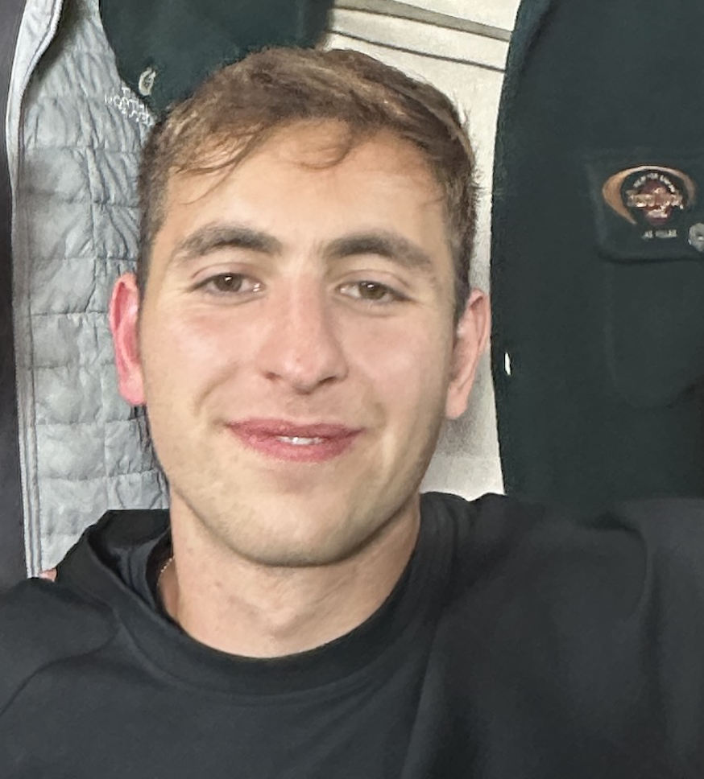

<!--
::: {.top-nav}
<a href="support/research.qmd">research</a> \ 
<a href="support/personal_projects.qmd">personal projects</a> \ 
<a href="support/almost_sure.qmd">musings</a> \ 
<a href="support/reducible_error.qmd">more musings</a> \ 
<a href="support/extrascholastic.qmd">fun</a> 
:::
-->
::: {.top-nav}
<a href="support/research.qmd">research</a>
:::

# Oliver Hannaoui

<!--

-->
Greetings! I am a first-year Statistics PhD student at <a href="https://www.cmu.edu/dietrich/statistics-datascience/index.html" class="paper">Carnegie Mellon University</a>. I am also a member of the <a href="https://delphi.cmu.edu" class="paper">Delphi group</a>, where I work on projects related to infectious disease forecasting. 

Previously, I spent a year in Paris where I completed an <a href="https://www.ip-paris.fr/en/education/masters/applied-mathematics-and-statistics-program/master-year-1-applied-mathematics-and-statistics" class="paper">M1 in Applied Mathematics and Statistics</a> at the Polytechnic Institute of Paris. During my time in Paris, I also completed an AI engineering internship at <a href="https://en.ennov.com" class="paper">Ennov</a>.

Prior to that, I spent two formative years in New York City at the <a href="https://www.newyorkfed.org/research" class="paper">Federal Reserve Bank of New York</a> as a Senior Research Analyst in the Financial Intermediation group. And right before that, I graduated with bachelor's degrees in <a href="https://economics.ucdavis.edu" class="paper">Economics</a> and <a href="https://statistics.ucdavis.edu" class="paper">Statistics</a> from the University of California, Davis.    

I can be contacted via <a href="mailto:ozh@stat.cmu.edu" class="paper">e-mail</a> or <a href="https://www.linkedin.com/in/oliver-hannaoui/" class="paper">LinkedIn </a>. 

